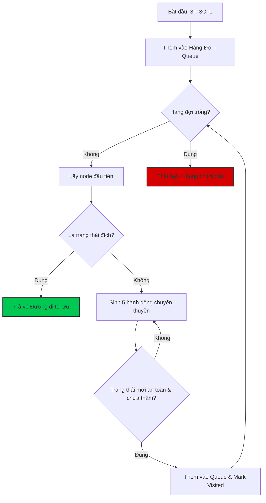
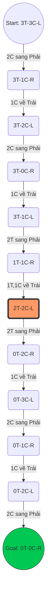

# ĐỒ ÁN AI: GIẢI MÃ BÀI TOÁN QUA SÔNG (3 TRIỆU PHÚ & 3 TÊN CƯỚP)

Dự án này triển khai thuật toán **Tìm kiếm trong không gian trạng thái (State Space Search)** sử dụng thuật toán **BFS (Breadth-First Search)** để tìm lời giải tối ưu cho bài toán qua sông kinh điển.

---

## 1. PHÂN TÍCH BÀI TOÁN (PROBLEM ANALYSIS)

### 1.1. Mô hình hóa trạng thái (State Modeling)
Mỗi trạng thái được ký hiệu là `(T, C, B)` đại diện cho số lượng ở **Bờ Trái**:
- **T (Triệu phú)**: 0, 1, 2, 3
- **C (Cướp)**: 0, 1, 2, 3
- **B (Thuyền)**: L (Trái) hoặc R (Phải)

Trạng thái đích (Goal State) là khi toàn bộ 6 người ở bờ Phải: `(0, 0, R)`.

### 1.2. Quy tắc sinh tử (Constraints)
Quy tắc cốt lõi: **Nếu Số Triệu Phú (T) > 0, thì T >= C**. Điều này áp dụng cho cả hai bờ sông và ngay cả trên thuyền. Nếu vi phạm, cướp sẽ tấn công triệu phú.

---

## 2. KIẾN TRÚC GIẢI THUẬT (ALGORITHM ARCHITECTURE)

Chúng ta sử dụng **Breadth-First Search (BFS)** để đảm bảo tìm thấy đường đi ngắn nhất (ít chuyến thuyền nhất). 

### 2.1. Sơ đồ luồng xử lý (General Flowchart)
Sơ đồ này mô tả cách thuật toán AI tìm kiếm trong không gian trạng thái:



---

## 3. PHÂN TÍCH CÁC TRƯỜNG HỢP (CASES ANALYSIS)

Hiểu rõ lý do tại sao các bước đi sai dẫn đến thất bại là chìa khóa để xây dựng Heuristic.

| Trường hợp | Hành động | Kết quả | Bài học |
| :--- | :--- | :--- | :--- |
| **Case 1** | Để 2 Triệu phú đi trước | **Game Over** (Bờ trái còn 1T-3C) | Phải ưu tiên đưa Cướp đi trước để giảm áp lực. |
| **Case 2** | Tách lẻ 1 Triệu phú sang đích | **Nguy hiểm** (Dễ bị cô lập khi Cướp chèo thuyền về) | Triệu phú cần đi theo cặp hoặc có đồng đội chờ sẵn. |
| **Nút thắt** | Bước 6 (Giữa game) | **Phải chèo về cả 1T và 1C** | Đây là bước duy nhất duy trì cân bằng ở cả 2 bờ. |

---

## 4. LỘ TRÌNH VÀNG (THE GOLDEN PATH - 11 BƯỚC)

Dưới đây là sơ đồ chi tiết các bước di chuyển:



---

## 5. HƯỚNG DẪN CÀI ĐẶT & CHẠY DEMO

Dự án sử dụng công nghệ Web tiêu chuẩn, không cần cài đặt môi trường phức tạp.

1.  **Chạy Visualizer**: Mở file `index.html` bằng trình duyệt để xem mô phỏng 2D với Tailwind CSS.
2.  **Chạy CLI Solver**: Sử dụng Node.js để chạy code logic:
    ```bash
    node solver.js
    ```

### Cấu trúc Repository
- `index.html`: Giao diện tương tác người dùng.
- `solver.js`: Chứa hàm `giaiBaiToanBFS` xử lý logic AI.
- `README.md`: Tài liệu đặc tả (file này).

---

## 6. KẾT LUẬN
Bài toán Triệu phú & Cướp minh chứng sức mạnh của thuật toán tìm kiếm duyệt đồ thị. Dù không gian trạng thái nhỏ, nhưng tính logic và các ràng buộc an toàn đòi hỏi một quy trình xử lý chính xác tuyệt đối, nơi mà BFS luôn tìm ra con đường ngắn nhất và an toàn nhất.
